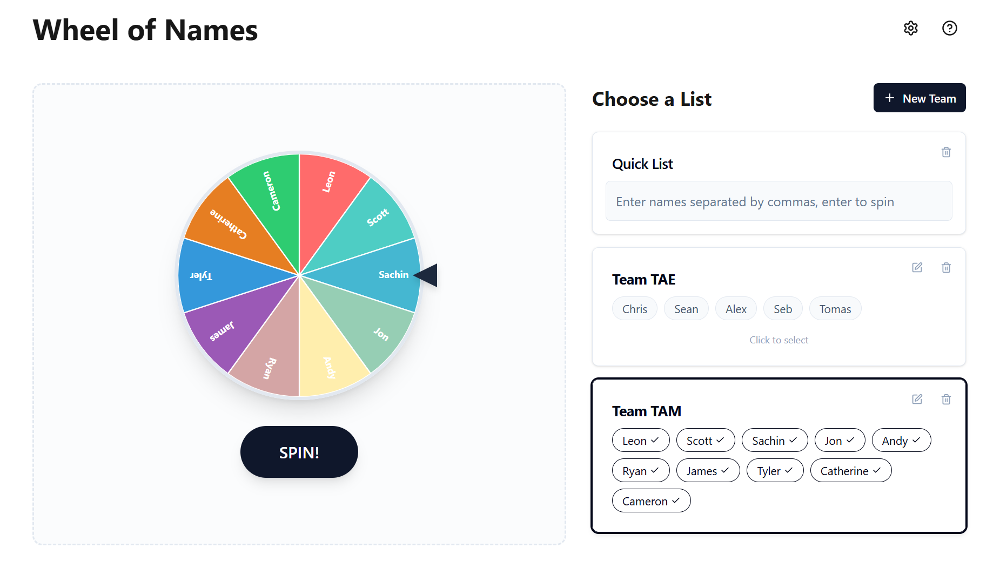

# Reinvented Wheel of Names

A modern, feature-rich, and aesthetically pleasing random name picker application built with Next.js, Tailwind CSS, and Framer Motion.



## Features

-   **🎯 Physics-Based Wheel**: A satisfying, responsive wheel with realistic physics and confetti celebrations.
-   **👥 Team Management**: Create, edit, and persist multiple teams with member lists. Data is saved locally.
-   **📝 Ad-Hoc Lists**: A "Quick List" mode for temporary, on-the-fly name picking.
-   **⚙️ Admin Panel**:
    -   **Backup & Restore**: Export your teams and settings to JSON and restore them later.
    -   **Debug Tools**: Verbose logging for physics debugging.

## Getting Started

First, install dependencies and run the development server:

```bash
npm install
npm run dev
```

Open [http://localhost:3000](http://localhost:3000) with your browser to see the result.

## Usage Guide

### Managing Teams
1.  **Create a Team**: Click the **"New Team"** button or press `N`.
2.  **Add Members**: Type a name and press `Enter`. Press `Enter` on an empty line to save.
3.  **Edit/Delete**: Use the icons on the team cards to manage your lists.
4.  **Drag & Drop**: Reorder teams and the Quick List by dragging them.

### Spinning the Wheel
-   **Spin**: Click the **"SPIN"** button in the center of the wheel or press `Enter`.
-   **Winner**: A modal will announce the winner with a confetti shower.

### Admin & Settings
-   **Settings**: Click the **Gear Icon** in the top header to open the Admin Panel.
    -   **Data**: Export your data for backup or import a previous backup.
    -   **Debug**: Enable verbose logging in the console.

## Keyboard Shortcuts

| Key | Action |
| :--- | :--- |
| **`N`** | Create a **N**ew Team |
| **`Enter`** | **Spin** the wheel (when not typing) |
| **`↑` / `↓`** | Navigate between teams |
| **`?`** or **`H`** | Open **H**elp & Shortcuts |
| **`ESC`** | Close any open modal |

## Tech Stack

-   **Framework**: [Next.js 15](https://nextjs.org/) (App Router)
-   **Styling**: [Tailwind CSS](https://tailwindcss.com/)
-   **Animations**: [Framer Motion](https://www.framer.com/motion/)
-   **State Management**: [Zustand](https://github.com/pmndrs/zustand)
-   **Persistence**: [Dexie.js](https://dexie.org/) (IndexedDB)
-   **Drag & Drop**: [dnd-kit](https://dndkit.com/)
